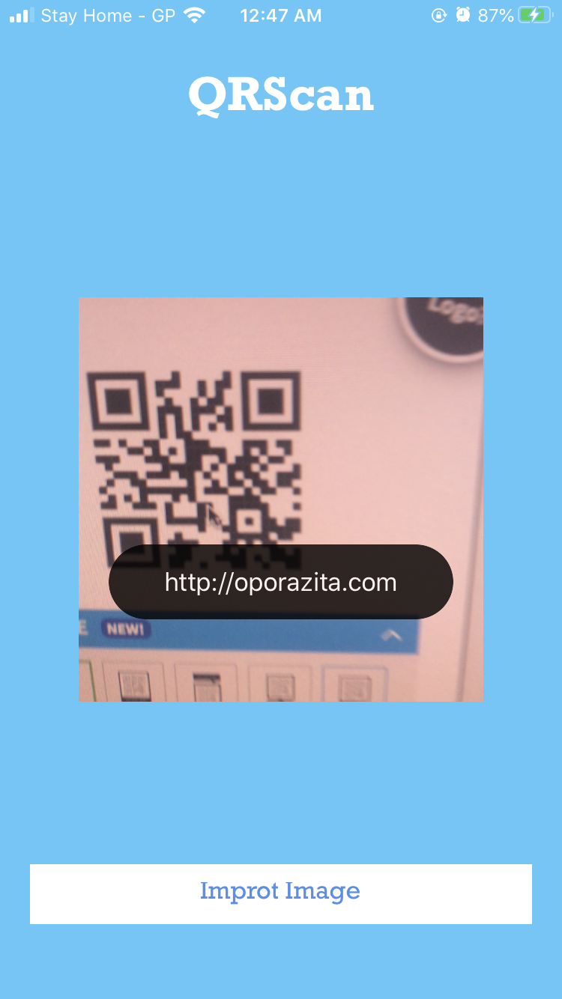

# QR Scanner

[![Swift Version][swift-image]][swift-url]
[![License][license-image]][license-url] 

It's a Simple QR Scanner app written in swift using **AVFoundation**. It can Scan QR from Image Gallery and Camera also. 
After successfully scan a QR it will navigate to the Safari browser if the QR contains a URL.

## Features

- [x] Scan QR using Camera
- [x] Scan from Gallery
- [x] Direct browse a Link

## Requirements

- iOS 10.0+

#### Run Project

You need to add the "Privacy - Camera usage description" key to your app’s Info.plist
1. Download or clone project.  
2. Congratulations!  

## Contribute

We would love you for the contribution to **QRScanner**.

## Meta

Md. Jonayed Hossain Chowdhury – – jonayedhossain1995@gmail.com

Distributed under the MIT license. See ``LICENSE`` for more information.

[Github Link](https://github.com/Nibir00795)

[swift-image]:https://img.shields.io/badge/swift-5.0-orange.svg
[swift-url]: https://swift.org/
[license-image]: https://img.shields.io/badge/License-MIT-blue.svg
[license-url]: LICENSE
[travis-image]: https://img.shields.io/travis/dbader/node-datadog-metrics/master.svg?style=flat-square
[travis-url]: https://travis-ci.org/dbader/node-datadog-metrics
[codebeat-image]: https://codebeat.co/badges/c19b47ea-2f9d-45df-8458-b2d952fe9dad
[codebeat-url]: https://codebeat.co/projects/github-com-vsouza-awesomeios-com
